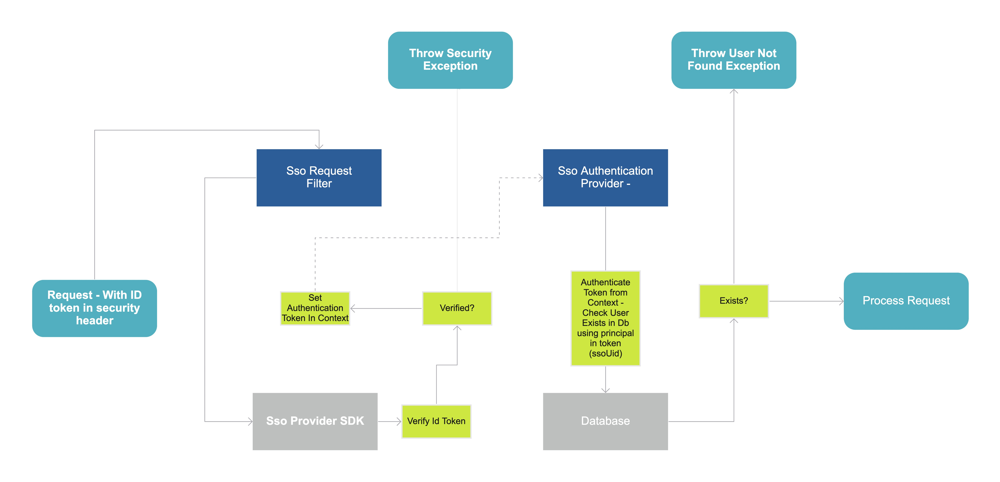

# spring-boot-starter-sso-security
Spring library for integrating sso security - implemented using Firebase

This is an auto configuration library for enabling sso security. It is currently implemented with firebase but is written to allow other implementations being added.

If this library is present, the security mechanism is enabled.

A user can define how the library will handle certain requests in the application properties.
All requests that are not sso disabled in the application properties must include a authorization header specified in the sso provider configuration in the application properties

For firebase, the private key file must be stored in `src/main/resources/firebase/private-key.json` or in any other place, defined in application properties

Here's a diagram of the flow:

